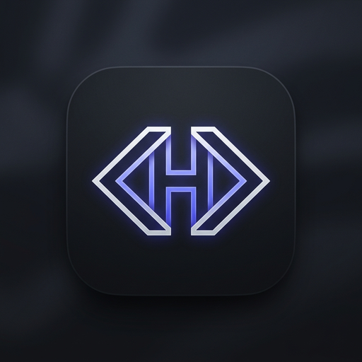

<div align="center">



# Hesh

**A high-performance React component library with polished defaults, token-driven theming and accessibility built in.**

React is the only peer dependency. No CSS-in-JS runtime, no icon package, no positioning library.

[](https://www.npmjs.com/package/hesh)
[](https://www.typescriptlang.org/)
[-26.3%20kB-22c55e)](https://bundlephobia.com)
[-14.9%20kB-22c55e)](https://bundlephobia.com)
[](#accessibility)

</div>

---

## Why another component library?

Most libraries ask you to choose between two bad options: a rigid design system
that fights you the moment you want something distinctive, or an unstyled
primitive kit that leaves every interaction detail to you.

Hesh takes a third path. Components ship **finished** — states, focus
rings, keyboard behaviour, loading and empty states — but every visual decision
routes through a small token layer you can override in one place. Rebranding is
a 10-line CSS change, not a refactor.

- **Finished, not prescribed.** Polished out of the box; a token layer underneath.
- **Zero runtime dependencies.** No emotion, no floating-ui, no icon package.
- **CSS you can read.** Semantic class names and custom properties — no build plugin.
- **Accessibility that is tested, not claimed.** 13 behavioural assertions run on every change.
- **Charts included.** Area, bar, donut and sparkline — no charting dependency.
- **Progressive disclosure.** Simple by default; escape hatches where they matter.

---

## Install

```bash
npm install hesh
```

React 18 or newer. Works with Vite, Next.js App Router and Pages Router, Remix
and CRA — there is no bundler plugin to configure.

---

## Quick start

```tsx
// 1. Import the stylesheet once, near the root of your app
import 'hesh/styles.css';

// 2. Wrap your tree in the theme provider
import { ThemeProvider } from 'hesh';

export default function RootLayout({ children }) {
  return (
    <html lang="en">
      <body>
        <ThemeProvider defaultMode="system">{children}</ThemeProvider>
      </body>
    </html>
  );
}
```

```tsx
// 3. Build
import { Button, Card, CardBody, CardHeader, Input } from 'hesh';

export function SignupCard() {
  return (
    <Card>
      <CardHeader
        title="Create your account"
        description="14 days free. No card required."
      />
      <CardBody>
        <Input label="Work email" type="email" placeholder="you@company.com" />
        <Button fullWidth size="lg">
          Start building
        </Button>
      </CardBody>
    </Card>
  );
}
```

### Server-side rendering

Everything renders on the server without special handling. The one thing a
server cannot know is the user's stored theme — drop in the init script to
eliminate the flash of wrong theme:

```tsx
import { themeInitScript } from 'hesh';

<html lang="en" suppressHydrationWarning>
  <head>
    <script dangerouslySetInnerHTML={{ __html: themeInitScript }} />
  </head>
  ...
</html>;
```

---

## What's included

| | |
|---|---|
| **Forms** | `Button` `IconButton` `ButtonGroup` `Input` `Textarea` `Select` `Combobox` `Checkbox` `Radio` `RadioGroup` `Switch` |
| **Display** | `Card` `Badge` `Avatar` `AvatarGroup` `Separator` `Skeleton` `Stat` `Progress` `Kbd` |
| **Overlays** | `Dialog` `Drawer` `ConfirmDialog` `DropdownMenu` `Tooltip` `Toast` |
| **Navigation** | `Tabs` `SidebarNav` `PageHeader` `Breadcrumbs` `Pagination` |
| **Data** | `DataTable` — sorting, selection, loading, empty states |
| **Advanced** | `Command` (⌘K palette) `Popover` `Accordion` `Slider` `Calendar` `DatePicker` |
| **Charts** | `AreaChart` `BarChart` `DonutChart` `Sparkline` `ChartLegend` |
| **System** | `ThemeProvider` `useTheme` `ThemeSwitch` design tokens, density presets |
| **Hooks** | `useControllableState` `useFocusTrap` `useDismiss` `useFloating` `useToast` |

---

## Theming

Three layers, one stylesheet:

```
Layer 1  Primitives   --pui-brand-500, --pui-neutral-900, --pui-space-4
Layer 2  Semantic     --pui-primary, --pui-fg-muted, --pui-border, --pui-surface
Layer 3  Component    --btn-h, --ctrl-h  (computed from Layer 2 × density)
```

Components only ever read Layer 2, so you can retarget intent without touching
material:

```css
:root {
  --pui-primary:       #7c5cff;
  --pui-primary-hover: #6a49f2;
  --pui-radius-md:     0.25rem;
  --pui-font-sans:     'Söhne', system-ui, sans-serif;
}
```

For a full rebrand, replace the 11-step `--pui-brand-*` ramp and everything
follows. Any value can also be scoped to a subtree:

```html
<section data-pui-theme="dark">…</section>
<html data-pui-density="compact">…</html>
```

---

## Accessibility

Every interactive component implements its WAI-ARIA pattern, and the behaviour
is asserted in tests rather than asserted in prose:

| Component | Pattern |
|---|---|
| `Dialog`, `Drawer` | Focus trapped, focus restored to trigger on close, Escape closes, scroll locked |
| `DropdownMenu` | Menu button; `aria-activedescendant`, wrapping arrows, type-to-search |
| `Combobox` | Editable combobox with listbox popup; `aria-autocomplete`, `aria-activedescendant` |
| `Tabs` | Roving tabindex; arrows, Home/End, disabled tabs skipped |
| `DataTable` | `aria-sort` on headers, `aria-checked="mixed"` on partial selection |
| `Switch` | `role="switch"` with `aria-checked` |
| `Checkbox` | Tri-state reported as `aria-checked="mixed"` |
| `Toast` | Polite live region; assertive only for danger and warning |
| `Alert` | `role="status"`, upgrading to `role="alert"` for warning and danger |

Run the suite:

```bash
npm test
```

```
15/15 routes clean

Accessibility behaviour
✓ dialog traps focus, labels itself, and closes on Escape
✓ menu reports expanded state and highlights the first row
✓ tabs use roving tabindex and arrow keys move selection
✓ sortable headers expose aria-sort and toggle direction
✓ select-all checkbox reports the mixed state
✓ combobox wires aria-expanded, aria-controls and activedescendant
✓ error state sets aria-invalid and links the message
✓ accordion reports expanded state and toggles
✓ slider is a native range input with correct value semantics
✓ command palette opens on the shortcut and tracks the active row
✓ calendar exposes a grid with selected and today states
✓ charts expose a text alternative
✓ progress bars expose or omit aria-valuenow correctly
```

The suite mounts every documentation page in jsdom and drives real keyboard and
pointer events. It catches the class of bug a type checker cannot — missing
providers, effects that throw, and ARIA attributes that silently stop updating.

---

## Bundle

| File | Size | Gzip |
|---|---|---|
| `index.js` (ESM) | 96.9 kB | 23.5 kB |
| `index.cjs` (CJS) | 63.8 kB | 19.5 kB |
| `hesh.css` | 91.3 kB | 14.9 kB |

The package is ESM-first with `sideEffects: ["**/*.css"]`, so bundlers drop
unused components. Importing a single `Button` pulls in that component, its
icons and the `cn` helper — nothing else.

---

## Development

```bash
npm install
npm run dev        # docs site with live examples at localhost:5173
npm test           # render + accessibility behaviour suite
npm run typecheck  # strict TypeScript
npm run build      # ESM + CJS + .d.ts + bundled stylesheet
npm run build:docs # static docs site
```

### Repository layout

```
src/
  components/   one file per component family; each is self-contained
  hooks/        useControllableState, useFocusTrap, useDismiss, useFloating, useTheme
  styles/       variables.css (tokens) → base.css (reset) → components.css
  utils/cn.ts   class name helper
docs/           documentation site — every example is a live component
scripts/        smoke test and CSS bundler
```

Components are written to be read. If you need a variant that does not exist,
copy the file into your project — the API is small enough to own.

---

## Browser support

Evergreen browsers: Chrome/Edge 111+, Safari 16.4+, Firefox 128+.

Relies on `:focus-visible`, CSS custom properties, `color-mix()`, `oklab()` and
logical properties. No polyfills are included.

---

## Status

Early release (`0.1.x`). The API is stable enough to build on, but expect
refinements before `1.0`. See [the changelog](CHANGELOG.md).

## License

MIT © [Mahesh Abeykoon](https://github.com/Mahesh-Abeykoon)
